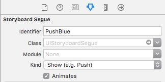

# Unwind-Segue-Demo
Barebones demo of using unwind segues to prevent nasty navigation stacks

Also see [Apple's documentation](https://developer.apple.com/library/ios/technotes/tn2298/_index.html#//apple_ref/doc/uid/DTS40013591-CH1-DETDEST)

# Adding Unwind Segues

## Declare The Segue

In each `UIViewController` subclass that should support unwind segues(I've used the `RedViewController` here), an `IBAction` like the following should be added:

```
@IBAction func unwindToRedViewController(segue: UIStoryboardSegue) {}
```

The action doesn't need to do anything, it's just there to serve as an access point for storyboards and such.

## Connect The Segue

To make the unwind segue available to use programmatically by a view controller, control+click on the view controller icon in your scene, and connect it to the exit.


Choose the unwind segue from the menu


Make sure to give the segue an identifier.


## Choose Your Segue

In this storyboard, we have two buttons with normal `show` segues going to two other view controllers.


In order to choose between segues later, each segue has an identifier, just like the unwind segues.




If we don't want to push an additional destination view controller onto the navigation stack if one of it's kind already exists, we can decide to use the unwind segue instead by implementing `shouldPerformSegueWithIdentifier(_:sender:)` in our view controller

```
override func shouldPerformSegueWithIdentifier(identifier: String, sender: AnyObject?) -> Bool {
    guard let navigationController = navigationController else { return true }

    if identifier == "PushGreen" && navigationController.childViewControllers.filter({ $0.isKindOfClass(GreenViewController) }).count > 0 {
        performSegueWithIdentifier("unwindGreen", sender: self)
        return false
    } else if identifier == "PushBlue" && navigationController.childViewControllers.filter({ $0.isKindOfClass(BlueViewController) }).count > 0 {
        performSegueWithIdentifier("unwindBlue", sender: self)
        return false
    }

    return true
}
```

Now, if we are attempting to show a view controller via the `show` segue and one of those view controllers is already in the navigation stack, we will pop to it instead.